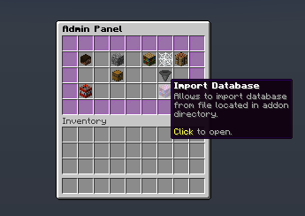
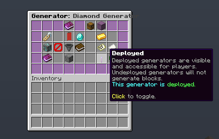

# MagicCobblestoneGenerator

**MagicCobblestoneGenerator** transforme les générateurs de roche plats et ennuyeux en une source géniale et fiable de blocs configurables!

Créé et maintenu par [BONNe](https://github.com/BONNe).

{{ addon_description("MagicCobblestoneGenerator") }}

## Installation

1. Placez le fichier jar de l'addon dans le dossier des addons du plugin BentoBox
2. Redémarrez le serveur
3. Exécutez la commande `/[admincmd] generator` pour configurer l'addon

## Configuration

Par défaut, l'addon tente d'importer toutes les données du fichier modèle, pour simplifier la première configuration. De nombreux paramètres du addon sont exposés dans l'interface graphique Admin, cependant, certains ne le sont pas.
Les dernières options de configuration et leurs explications détaillées se trouvent [ici](https://github.com/BentoBoxWorld/MagicCobblestoneGenerator/blob/develop/src/main/resources/config.yml).

Les fichiers modèles sont principalement pour les utilisateurs qui n'aiment pas utiliser l'interface graphique d'édition en jeu. Cependant, le fichier modèle n'est pas automatiquement importé à chaque modification. Cela nécessite une importation via une commande ou l'interface graphique Admin.

??? question "Structure du fichier modèle"
    ```
    # Commencez à répertorier tous les niveaux de générateur.
    tiers:
      # Id unique pour le générateur. Utilisé dans le stockage interne et l'accès à chaque donnée du générateur.
      generator_unique_id:
        # Nom d'affichage pour les utilisateurs. Supporte les codes de couleur.
        # Valeur par défaut: generator_unique_id sans _
        name: "Something fancy"
        # Description en message de lore. Supporte les codes de couleur.
        # Peut être défini vide en remplaçant tout par [].
        # Valeur par défaut: []
        description: -|
          First Line Of lore Message
          &2Second Line Of lore Message
        # Icône utilisée dans les interfaces graphiques. Le nombre à la fin permet de spécifier la taille de la pile pour l'article.
        # Valeur par défaut: Paper.
        icon: "PAPER:1"
        # Type de générateur : quelle mécanique de lave vanilla ce niveau remplace.
        # COBBLESTONE, STONE, BASALT, COBBLESTONE_OR_STONE, BASALT_OR_COBBLESTONE,
        # BASALT_OR_STONE ou ANY. Voir la section "Types de générateur" ci-dessous.
        # Valeur par défaut: COBBLESTONE
        type: COBBLESTONE
        # Indique si le générateur est le générateur par défaut. Les générateurs par défaut ignorent la section des conditions.
        # Il est activé pour chaque nouvelle île. Il ne peut y en avoir qu'un par type de générateur.
        # Valeur par défaut: false
        default: false
        # Les utilisateurs sélectionnent les générateurs actifs.
        # La priorité indique quel générateur sera utilisé
        # si plusieurs d'entre eux remplissent les conditions.
        # Valeur par défaut: 1
        priority: 1
        # Il existe plusieurs exigences qui peuvent être définies ici.
        requirements:
          # Peut définir le niveau d'île minimum pour que le générateur fonctionne. Addon de niveau requis.
          # Valeur par défaut: 0
          island-level: 10
          # Liste des permissions requises pour que les utilisateurs sélectionnent ce générateur.
          # Valeur par défaut: []
          required-permissions: []
          # Liste des biomes requis pour que le générateur fonctionne.
          # Vide signifie qu'il n'y a pas de limitation dans quel biome le générateur fonctionne.
          # Valeur par défaut: [].
          required-biomes: []
          # Coût pour acheter ce générateur. Nécessite Vault et n'importe quel plugin d'économie.
          # Actuellement implémenté en cliquant sur l'icône d'achat dans l'interface graphique de visualisation du générateur.
          # Valeur par défaut: 0
          purchase-cost: 5.0
        # Coût pour activer le niveau de générateur actuel. Nécessite Vault et n'importe quel plugin d'économie.
        # Sera payé uniquement lors du changement actif entre les générateurs.
        # Valeur par défaut: 0.
        activation-cost: 0.0
        # Matériaux et leurs chances. Utilisez les blocs réels s'il vous plaît.
        # La chance supporte n'importe quel nombre positif, y compris la valeur double.
        # Tout à la fin sera normalisé.
        # Valeur par défaut: []
        blocks:
          FIRST_BLOCK_NAME_ID: NUMBER
          SECOND_BLOCK_NAME_ID: NUMBER
        # Trésor qui a une chance d'être lâché quand le bloc est généré.
        # SEULEMENT à la génération, pas au cassage de bloc.
        # Valeur par défaut: []
        treasure:
          # Chance de 0 till 1. 0 - ne sera pas possible d'obtenir un trésor.
          # Valeur par défaut: 0
          chance: 0.001
          # Matériaux qui peuvent être lâchés. S'applique aux mêmes règles que la section des blocs.
          # Valeur par défaut: []
          material:
            FIRST_BLOCK_NAME_ID: NUMBER
            SECOND_BLOCK_NAME_ID: NUMBER
          # Montant maximal d'articles lâchés.
          # Il sera de 1 till montant défini.
          # Valeur par défaut: 1
          amount: 1
    
    # Commencez à répertorier tous les bundles
    bundles:
      # bundle_id
      bundle_unique_id:
        # Nom d'affichage pour les utilisateurs
        name: "Something fancy"
        # Description en message de lore. Supporte les codes de couleur.
        # Peut être défini vide en remplaçant tout par [].
        # Valeur par défaut: []
        description: -|
          First Line Of lore Message
          &2Second Line Of lore Message
        # Icône utilisée dans les interfaces graphiques. Le nombre à la fin permet de spécifier la taille de la pile pour l'article.
        # Valeur par défaut: Paper.
        icon: "PAPER:1"
        # Liste des générateurs auxquels le bundle aura accès.
        generators:
          - generator_id_1
          - generator_id_2
    ```

### Types de générateur (quelle mécanique de lave remplace un niveau)

Minecraft crée des blocs à partir de lave de quatre façons différentes, et un niveau de générateur ne fonctionne que pour ceux que son **type** couvre. C'est le paramètre principal qui contrôle *où* un générateur peut être utilisé :

| Mécanique vanilla | Bloc que vanilla crée | Type de générateur |
|---|---|---|
| Une **source** de lave touche l'eau | Obsidienne | *non géré par l'addon* |
| La **lave qui s'écoule** touche l'eau au même niveau | Pavé | `COBBLESTONE` |
| La **lave qui s'écoule** s'écoule dans l'eau | Pierre | `STONE` |
| La **lave qui s'écoule** s'écoule sur la terre maudite à côté de la glace bleue | Basalte | `BASALT` |

Le type est défini par niveau de générateur, soit dans l'interface graphique Admin — `/[admin] generator` → choisir un niveau → le bouton **Type**, qui ouvre un sélecteur listant chaque type avec un indice sur la mécanique derrière — soit avec la clé `type:` dans le fichier modèle. Les types combinés `COBBLESTONE_OR_STONE`, `BASALT_OR_COBBLESTONE`, `BASALT_OR_STONE` et `ANY` rendent un niveau actif pour plus d'une mécanique.

!!! warning "Les générateurs `STONE` fonctionnent sur n'importe quel plan d'eau"
    Un générateur `STONE` fonctionne partout où un joueur peut verser de la lave sur l'eau — y compris l'océan ouvert dans la gamme de protection de l'île. Sur les modes de jeu riches en eau comme **AcidIsland**, un seul seau de lave peut donc convertir de grandes quantités d'océan en blocs de générateur, et augmenter le niveau de l'île avec. Deux façons d'empêcher cela :

    - **Ne donnez pas aux joueurs des niveaux `STONE`.** Utilisez les types `COBBLESTONE` et/ou `BASALT` uniquement, pour que la génération de blocs nécessite un générateur correctement construit.
    - **Limitez la plage de hauteur.** Donnez aux niveaux `STONE` un Y minimum et maximum qui exclut le niveau des mers, pour qu'ils fonctionnent dans les grottes ou bien au-dessus de l'eau mais pas à la surface de l'océan. Voir [Plages de hauteur par bloc](#plages-de-hauteur-par-bloc).

### Épuisement du générateur (limitation du débit)

Depuis **2.8.0** les générateurs peuvent être plafonnés pour ne produire qu'un nombre défini de blocs dans une période donnée avant de passer en cooldown — utile pour décourager les fermes AFK entièrement automatisées. La fonctionnalité est **opt-in et désactivée par défaut** (une limite de `0`), donc les configurations existantes ne sont pas affectées jusqu'à ce que vous l'activiez. Quand un générateur est temporairement en cooldown, les joueurs reçoivent un message `generator-exhausted`.

=== "exhaustion.limit"
    !!! summary "Description"
        Le nombre par défaut de blocs qu'un générateur peut produire au cours d'une seule période d'épuisement. `0` ou moins désactive la limitation (la valeur par défaut). Chaque niveau de générateur peut remplacer ceci via la clé `exhaustion-limit` par niveau (voir ci-dessous).

        Défaut : `0`

=== "exhaustion.period"
    !!! summary "Description"
        La durée de la période d'épuisement, en **minutes**. Le comptage des blocs se réinitialise à la fin de chaque période.

        Défaut : `60`

=== "exhaustion.cooldown"
    !!! summary "Description"
        Combien de temps, en **minutes**, un générateur reste en cooldown après avoir atteint sa limite d'épuisement.

        Défaut : `1440` (24 heures)

=== "exhaustion.notification-cooldown"
    !!! summary "Description"
        Le temps minimum, en **secondes**, entre deux messages d'avertissement d'épuisement affichés au même joueur.

        Défaut : `60`

!!! tip "Limite par niveau"
    Chaque niveau de générateur peut remplacer la limite globale avec une clé `exhaustion-limit` dans le modèle de générateur (et dans l'interface graphique admin), de sorte que différents niveaux peuvent être étranglés indépendamment.

### Plages de hauteur par bloc

Également depuis **2.8.0**, les générateurs — et les blocs individuels au sein d'un générateur — peuvent être limités à un niveau Y minimum et maximum, de sorte que différents matériaux sont produits à différentes hauteurs. De nouveaux boutons de l'interface graphique permettent aux admins de définir et d'effacer la plage, et la lore du générateur montre aux joueurs où chaque générateur opère. Les modèles hérités sans plage de hauteur restent pleinement compatibles.

### Progression du déverrouillage et exigences

Depuis **2.9.0**, les générateurs peuvent être verrouillés derrière des exigences plus riches pour que vous puissiez concevoir des arborescences de déverrouillage appropriées au lieu d'une liste plate de niveaux. Tous ces éléments sont configurés à partir du panneau d'édition des générateurs dans l'interface graphique Admin :

- **Générateurs préalables** — exiger que un ou plusieurs autres générateurs soient d'abord déverrouillés, en construisant des progressions multi-étapes.
- **Exigence de phase AOneBlock** — sur les modes de jeu AOneBlock, verrou un générateur derrière une phase d'île spécifique, de sorte que les niveaux se déverrouillent au fur et à mesure que l'île avance.
- **Exigence de compte de blocs OneBlock** — verrou un générateur derrière le nombre de blocs cassés sur une île OneBlock.
- **Activer au déverrouillage** — une option par générateur qui active automatiquement un générateur au moment où il est déverrouillé, économisant aux joueurs un voyage à l'interface graphique.
- **Confirmation d'achat** — exiger éventuellement une confirmation explicite avant que de l'argent ne soit pris lors de l'achat d'un générateur, en évitant les achats accidentels.

=== "lose-tiers-on-level-loss"
    !!! summary "Description"
        *Ajouté dans 2.9.0.* Restaure le comportement antérieur à 2.0.0 où un générateur déverrouillé par niveau d'île est re-verrouillé si le niveau d'île chute ultérieurement en dessous de son exigence. Les niveaux achetés sont toujours conservés — seuls les niveaux gratuits, déverrouillés par niveau, sont re-verrouillés. Écrit automatiquement dans `config.yml` à la première charge après la mise à niveau.

        Défaut : `false`

!!! warning "Les générateurs verrouillés par permission sont maintenant révoqués"
    Depuis **2.9.0**, un générateur déverrouillé via permission est re-vérifié et **révoqué** des listes déverrouillées et actives de l'île lorsque le propriétaire actuel (en ligne) n'a plus la permission requise — par exemple après un transfert de propriété. Les niveaux achetés sont conservés, donc l'accès revient si la permission est retrouvée ; les propriétaires hors ligne sont laissés intacts. Auparavant, une telle concession était permanente.

### Sorties en blocs personnalisés (ItemsAdder, CraftEngine, Oraxen, Nexo)

Depuis **2.10.0**, un niveau de générateur peut produire des **blocs personnalisés** d'ItemsAdder, CraftEngine, Oraxen et Nexo, et pas seulement des matériaux vanilla — par exemple un minerai ItemsAdder incrusté de diamants entre dans le mélange aléatoire pondéré aux côtés de tout le reste. Tous les accès à ces plugins passent par les hooks du cœur de BentoBox, de sorte que le complément n'en dépend jamais directement.

- Les blocs sont stockés sous forme d'identifiants texte : des noms vanilla comme `COBBLESTONE`, ou des identifiants préfixés par fournisseur `itemsadder:namespace:id`, `craftengine:namespace:id`, `oraxen:id`, `nexo:id`. **Les bases de données et modèles existants se chargent sans modification.**
- Le panneau d'édition admin gagne un bouton **Ajouter un bloc personnalisé** — saisissez l'identifiant dans le chat et il est validé par rapport au registre des hooks. Les panneaux affichent les blocs personnalisés avec la texture et le nom d'affichage propres au fournisseur.
- Si un bloc personnalisé sélectionné est indisponible au moment de la génération (le fournisseur ou le bloc est absent), le générateur se rabat sur le bloc vanilla et explique pourquoi via `/[admin_command] generator why`, plutôt que d'échouer silencieusement. Les blocs personnalisés non enregistrés dans un modèle sont importés avec un avertissement, afin que les modèles restent portables entre serveurs.

!!! note "Disponibilité des fournisseurs"
    ItemsAdder et CraftEngine génèrent des blocs dès aujourd'hui. Oraxen et Nexo sont câblés et généreront une fois que les hooks correspondants du cœur de BentoBox seront livrés (BentoBox 3.20.0 ajoute le hook Nexo et `OraxenHook.placeBlock`).

!!! warning "Nécessite BentoBox 3.19.1 ou plus récent"
    2.10.0 dépend de l'API de hook de blocs personnalisés ajoutée dans BentoBox 3.19.1 et **ne se chargera pas sur un cœur plus ancien**. Mettez à jour BentoBox avant d'installer ce jar.

## Commandes

!!! tip
    `[player_command]` et `[admin_command]` sont les commandes qui diffèrent selon le mode de jeu que vous exécutez.
    Le fichier `config.yml` des Gamemodes contient des options qui vous permettent de modifier ces valeurs.
    Par exemple, sur BSkyBlock, le `[player_command]` par défaut est `island`, et l'`[admin_command]` par défaut est `bsbadmin`.
    Attention, cet addon permet de modifier les alias des commandes joueur dans le fichier `config.yml` de l'addon.

=== "Commandes joueur"
    - `/[player_command] generator`: Accédez à l'interface graphique de sélection du générateur.
    - `/[player_command] generator view <generator>`: Accédez à la vue détaillée d'un générateur spécifique.
    - `/[player_command] generator activate <generator> [false]`: Permet d'activer (ou désactiver) un générateur spécifique.
    - `/[player_command] generator buy <generator>`: Permet d'acheter un générateur spécifique.

=== "Commandes admin"
    - `/[admin_command] generator`: Accédez à l'interface graphique admin de l'addon
    - `/[admin_command] generator import`: Importe le fichier modèle par défaut - `/plugins/BentoBox/addons/MagicCobblestoneGenerator/generatorTemplate.yml`.
    - `/[admin_command] generator database import <file>`: Permet d'importer la base de données exportée <file>.
    - `/[admin_command] generator database export <file>`: Permet d'exporter la base de données dans <file> sauvegardé dans le dossier `/plugins/BentoBox/addons/MagicCobblestoneGenerator/`.
    - `/[admin_command] generator why <player>`: Une commande de débogage qui permet de trouver les problèmes avec les générateurs pour chaque joueur.
    - `/[admin_command] generator reset <player>`: Réinitialise les données du générateur de l'île d'un joueur — générateurs déverrouillés, achetés et actifs — après une invite de confirmation. *(Ajouté dans 2.9.0.)*

## Permissions

!!! tip
    `[gamemode]` est un préfixe qui diffère selon le mode de jeu que vous exécutez.
    Le préfixe est le nom du mode de jeu en minuscules, c'est-à-dire si vous utilisez BSkyBlock, le préfixe est `bskyblock`.
    De même, si vous utilisez AcidIsland, le préfixe est `acidisland`.

=== "Permissions joueur"
    - `[gamemode].stone-generator` - Permet au joueur d'utiliser la commande '/[player_command] generator' et ses sous-commandes.
    - `[gamemode].stone-generator.active-generators.3` - Définit le nombre maximum de générateurs actifs que le propriétaire de l'île peut avoir. 3 peut être remplacé par n'importe quel entier positif. Ceci n'est qu'un exemple.
    - `[gamemode].stone-generator.max-range.30` - Définit la distance maximale du générateur pour qu'il continue de fonctionner. 30 peut être remplacé par n'importe quel entier positif. Ceci n'est qu'un exemple.
    - `[gamemode].stone-generator.bundle.[bundle_id]` - Spécifie quel bundle sera utilisé pour l'île possédée par l'utilisateur.
    
=== "Permissions admin"
    - `[gamemode].admin.stone-generator` - Permet au joueur d'utiliser la commande '/[admin_command] generator' et ses sous-commandes.
    - `[gamemode].admin.stone-generator.why` - Permet au joueur d'utiliser la commande de débogage '/[admin_command] why generator <player>'.
    - `[gamemode].admin.stone-generator.database` - Permet au joueur d'utiliser la commande '/[admin_command] generator database' et ses sous-commandes.
    
??? question "Quelque chose manque?"
    Vous pouvez trouver la liste complète des permissions dans le fichier [addon.yml](https://github.com/BentoBoxWorld/MagicCobblestoneGenerator/blob/develop/src/main/resources/addon.yml) de cet addon.  
    Si quelque chose manque effectivement à la liste ci-dessous, veuillez nous le signaler!


## Placeholders

{{ placeholders_source(source="MagicCobblestoneGenerator") }}


## FAQ

??? question "Pouvez-vous ajouter une fonctionnalité X?"
    Veuillez l'ajouter à la liste [ici](https://github.com/BentoBoxWorld/MagicCobblestoneGenerator/issues).

??? question "Comment puis-je ajouter un nouveau niveau de générateur?"
    Actuellement, l'addon supporte 3 façons d'ajouter un nouveau générateur:
    
    - En utilisant l'interface graphique en jeu disponible via la commande `/[admin] generator`.
    - En ajoutant le générateur au fichier modèle.
    - En ajoutant le générateur au fichier de base de données exporté.

??? question "J'ai ajouté un générateur au fichier modèle/base de données, mais il n'apparaît pas en jeu."
    Pour faciliter la configuration avec plusieurs modes de jeu, les générateurs sont stockés dans la base de données interne. Après avoir modifié le fichier modèle ou de base de données, vous devez les importer dans cette mémoire. Vous pouvez le faire via l'interface graphique Admin en cliquant sur les boutons `Import Template` ou `Import Database`.
    
    {: loading=lazy }
    {: loading=lazy }

??? question "J'ai un générateur qui s'affiche dans l'interface graphique Admin, mais les joueurs ne le voient pas."
    C'est probablement dû au statut de "déploiement". Pour éviter les problèmes quand les joueurs commencent à activer les générateurs tandis qu'un admin les ajoute, les générateurs ne sont pas déployés et personne ne peut les utiliser. Vous pouvez les activer en modifiant le générateur via l'interface graphique Admin et en cliquant sur le levier dans l'interface graphique Editer le Générateur.
    {: loading=lazy }

??? question "Les joueurs utilisent un seau de lave sur l'océan pour générer des blocs. Comment puis-je arrêter cela ?"
    C'est un générateur `STONE` qui fonctionne comme prévu : vanilla transforme l'eau en pierre chaque fois que la lave s'écoule dessus, donc un niveau `STONE` fonctionne sur n'importe quelle eau que le joueur peut atteindre, l'océan ouvert inclus. Soit arrêtez de distribuer les niveaux `STONE` et utilisez les types `COBBLESTONE` et/ou `BASALT` à la place, soit donnez à vos niveaux `STONE` une plage de hauteur qui exclut le niveau de la mer. Voir [Types de générateur](#types-de-générateur-quelle-mécanique-de-lave-remplace-un-niveau).

??? question "Qu'est-ce que les trésors?"
    Les trésors sont des choses qui sont lâchées lors de la génération de bloc. Cela permet de donner une personnalisation supplémentaire pour chaque générateur.

??? question "Qu'est-ce que les bundles?"
    Les bundles sont une fonctionnalité qui permet de personnaliser davantage l'expérience pour chaque île. Si un bundle est attribué à une île, alors les joueurs de cette île ne pourront utiliser que les générateurs de ce bundle.

??? question "Puis-je désactiver l'affichage des permissions requises dans la description du générateur?"
    Oui, l'addon fournit beaucoup d'options de personnalisation pour afficher chaque générateur. Il est situé dans le fichier de locales:
    ```
          # Générateur de message de lore de générateur. Tous les éléments de la lore du générateur sont générés
          # basé sur la section ci-dessous.
          generator:
            # Contenu du principal élément de lore. Si vous ne voulez pas afficher les trésors du tout,
            # supprimez-les simplement de la section [treasures].
            # [description] provient de chaque niveau de générateur.
            # Lore ne supporte pas les codes de couleur. Chaque objet supporte séparément.
            lore: |-
              [description]
              [blocks]
              [treasures]
              [type]
              [requirements]
              [status]
            # Génère la section [blocks]
            blocks:
              # Première ligne dans la section des blocs. La ligne vide ne s'affichera pas.
              title: "&7&l Blocks:"
              # Chaque bloc et sa valeur sous le titre. Ne peut pas être vide.
              # Supporte [number], [#.#], [#.##], [#.###], [#.####], [#.#####]
              value: "&8 [material] - [#.##]%"
            # Génère la section [treasures]
            treasures:
              # Première ligne dans la section des blocs. La ligne vide ne s'affichera pas.
              title: "&7&l Treasures:"
              # Chaque trésor et sa valeur sous le titre. Ne peut pas être vide.
              # Supporte [number], [#.#], [#.##], [#.###], [#.####], [#.#####]
              value: "&8 [material] - [#.####]%"
            # Génère la section [requirements]
            requirements:
              # Permet de modifier l'ordre et le contenu du message des exigences.
              description: |-
                [biomes]
                [level]
                [missing-permissions]
              # Génère le message [level].
              level: "&c&l Required Level: &r&c [number]"
              # Génère le titre du message [missing-permission].
              permission-title: "&c&l Missing Permissions:"
              # Génère les valeurs du message [missing-permission].
              permission: "&c  -[permission]"
              # Génère le titre du message [biomes].
              biome-title: "&7&l Operates in:"
              # Génère les valeurs du message [biomes].
              biome: "&8 [biome]"
              # Génère le message [biomes] pour Tous les Biomes.
              any: "&7&l Operates in &e&o all &r&7&l biomes"
            # Génère la section [status]
            status:
              # Message affiché pour les générateurs verrouillés.
              locked: "&c Locked!"
              # Message affiché pour les générateurs qui ne sont pas déployés.
              undeployed: "&c Not Deployed!"
              # Message affiché pour les générateurs actifs.
              active: "&2 Active"
              # Message affiché pour les générateurs qui nécessitent un achat.
              purchase-cost: "&e Purchase Cost: $[number]"
              # Message affiché pour les générateurs qui ont un coût d'activation.
              activation-cost: "&e Activation Cost: $[number]"
            # Génère la section [type]
            type:
              title: "&7&l Supports:"
              cobblestone: "&8 Cobblestone Generators"
              stone: "&8 Stone Generators"
              basalt: "&8 Basalt Generators"
              any: "&7&l Supports &e&o all &r&7&l generators"
    ```

## Journal des modifications

??? warning "Nouveautés dans v2.10.0 — blocs personnalisés, nécessite BentoBox 3.19.1"
    **Publié :** 11 juillet 2026

    Les générateurs peuvent désormais produire des blocs personnalisés d'autres plugins, acheminés via les hooks du cœur de BentoBox.

    - 🔺 **Prise en charge des blocs personnalisés.** Les niveaux de générateur peuvent produire des blocs d'**ItemsAdder, CraftEngine, Oraxen et Nexo** en plus des matériaux vanilla. Les blocs sont stockés sous forme d'identifiants texte (`COBBLESTONE`, ou `itemsadder:namespace:id`, `craftengine:namespace:id`, `oraxen:id`, `nexo:id`) ; les bases de données existantes se chargent sans modification. Corrige [#103](https://github.com/BentoBoxWorld/MagicCobblestoneGenerator/issues/103). Voir la section Configuration ci-dessus.
    - ✨ **Bouton de panneau Ajouter un bloc personnalisé** avec validation de la saisie chat par rapport au registre des hooks ; les panneaux affichent les blocs personnalisés avec la texture et le nom propres au fournisseur. Les blocs personnalisés indisponibles se rabattent sur le bloc vanilla avec un rapport `/why` au lieu d'échouer silencieusement. ItemsAdder et CraftEngine génèrent dès aujourd'hui ; Oraxen et Nexo génèrent une fois les hooks de BentoBox 3.20.0 présents.
    - 🐛 **Les modifications de chance de trésor sont désormais enregistrées.** La modification de la chance d'un trésor dans le panneau admin écrivait dans le `treasureChanceMap` déprécié au lieu de `treasureItemChanceMap`, de sorte que les modifications étaient perdues — corrigé.
    - ⚙️ **Les modèles acceptent les blocs personnalisés.** `generatorTemplate.yml` accepte désormais des clés de blocs préfixées par fournisseur et entre guillemets. Aucune action de configuration n'est requise pour les installations existantes ; les blocs personnalisés non enregistrés sont importés avec un avertissement.
    - 🔡 **Note sur les locales :** de nouvelles clés `en-US.yml` ont été ajoutées pour l'interface des blocs personnalisés. Régénérez ou mettez à jour vos fichiers de locale pour récupérer les nouvelles chaînes.
    - 🔺 **Nécessite BentoBox 3.19.1 ou plus récent.** L'API de hook de blocs personnalisés que cette version appelle n'est disponible qu'à partir de 3.19.1 ; le complément ne se chargera pas sur un cœur plus ancien. Mettez d'abord BentoBox à jour.

    [Release v2.10.0](https://github.com/BentoBoxWorld/MagicCobblestoneGenerator/releases/tag/2.10.0)

??? warning "Nouveautés dans v2.9.0 — les générateurs verrouillés par permission sont maintenant révoqués"
    **Publié :** 8 juillet 2026

    Ajoute une progression de déverrouillage plus riche et plusieurs améliorations admin/API.

    - 🔒 **Générateurs préalables.** Verrou un générateur derrière un ou plusieurs autres pour que les niveaux se déverrouillent dans une progression conçue. Configuré via un nouveau sélecteur d'interface graphique admin. Corrige [#88](https://github.com/BentoBoxWorld/MagicCobblestoneGenerator/issues/88).
    - 🧱 **Verrouillage OneBlock / AOneBlock.** Exiger une phase AOneBlock spécifique, ou un nombre de blocs cassés sur une île OneBlock, avant qu'un générateur soit disponible. Corrige [#121](https://github.com/BentoBoxWorld/MagicCobblestoneGenerator/issues/121), [#117](https://github.com/BentoBoxWorld/MagicCobblestoneGenerator/issues/117).
    - ⚙️ **Re-verrouiller les niveaux au perte de niveau.** Un nouveau paramètre `lose-tiers-on-level-loss` (défaut `false`) re-verrouille les générateurs déverrouillés par niveau si le niveau d'une île chute. Les niveaux achetés sont toujours conservés. Corrige [#118](https://github.com/BentoBoxWorld/MagicCobblestoneGenerator/issues/118).
    - ✨ **Activer au déverrouillage.** Les générateurs peuvent maintenant s'activer automatiquement au moment où ils sont déverrouillés. Corrige [#106](https://github.com/BentoBoxWorld/MagicCobblestoneGenerator/issues/106).
    - 💰 **Confirmation d'achat.** Demander éventuellement aux joueurs de confirmer avant que l'argent ne soit pris pour un générateur. Corrige [#109](https://github.com/BentoBoxWorld/MagicCobblestoneGenerator/issues/109).
    - 🛠️ **Réinitialisation des données administrateur.** Une nouvelle commande `/[admin_command] generator reset <player>` réinitialise les générateurs déverrouillés, achetés et actifs d'un joueur après une invite de confirmation. Corrige [#149](https://github.com/BentoBoxWorld/MagicCobblestoneGenerator/issues/149).
    - 🔌 **Nouveaux événements API annulables** `GeneratorPreBuyEvent` et `GeneratorTreasureDropEvent` pour que d'autres addons se connectent (voir la section API ci-dessous).
    - 🔺 **Comportement changé :** les générateurs verrouillés par permission sont maintenant **révoqués** lorsque le propriétaire en ligne de l'île n'a plus la permission requise — par exemple après un transfert de propriété. Les niveaux achetés sont conservés, donc l'accès revient si la permission est retrouvée.
    - 🔡 **Remarque sur les locales :** de nouvelles clés `en-US.yml` ont été ajoutées pour le sélecteur préalable, l'activation au déverrouillage, la confirmation d'achat, la commande de réinitialisation admin, et les messages d'exigence OneBlock/AOneBlock. Régénérez ou mettez à jour vos fichiers de locale pour récupérer les nouvelles chaînes.

    [Release v2.9.0](https://github.com/BentoBoxWorld/MagicCobblestoneGenerator/releases/tag/2.9.0)

??? warning "Nouveautés dans v2.8.0 — nécessite BentoBox 3.14.0 / Java 21"
    **Publié :** 3 juillet 2026

    - ⚙️ **Épuisement du générateur.** Limitation optionnelle du nombre de blocs qu'un générateur produit par période, avec un cooldown une fois la limite atteinte. Configurable globalement (`exhaustion.*` dans `config.yml`) et par niveau de générateur (`exhaustion-limit` dans le modèle). Opt-in et désactivé par défaut. Voir la section Configuration ci-dessus.
    - **Plages de hauteur par bloc.** Limitez les générateurs et les blocs individuels à un niveau Y minimum/maximum, avec de nouveaux contrôles de l'interface graphique et une lore de face utilisateur.
    - 🔡 **Nouveaux placeholders** `[gamemode]_magiccobblestonegenerator_generator_exhaustion_status` et `[gamemode]_magiccobblestonegenerator_exhausted_generator_names` exposent l'état d'épuisement.
    - 🔡 🔺 **Locales MiniMessage + 13 nouvelles langues.** Chaque fichier de locale a été converti des codes couleur `&` legacy vers MiniMessage (que BentoBox 3.14 rend nativement), et des traductions ont été ajoutées pour cs, hr, hu, id, it, ja, ko, lv, nl, pt, pt-BR, ro et zh-HK — 24 locales au total, correspondant à BentoBox core. Si vous avez conservé vos propres modifications à n'importe quel fichier `locales/*.yml`, réappliquez-les au format MiniMessage (ou supprimez le fichier pour régénérer un frais).
    - 🔺 **Modernisé pour BentoBox 3.14 / Java 21.** Mis à jour vers l'API BentoBox et Paper actuels, avec la suite de tests migrée vers MockBukkit. Cette version ne se chargera pas sur les anciennes versions de BentoBox ou Java — mettez d'abord à jour BentoBox.

    [Release v2.8.0](https://github.com/BentoBoxWorld/MagicCobblestoneGenerator/releases/tag/2.8.0)

## Traductions

{{ translations("MagicCobblestoneGenerator") }}

## API

Depuis MagicCobblestoneGenerator 2.4.0 et BentoBox 1.17, d'autres plugins peuvent accéder directement aux données du addon MagicCobblestoneData. Cependant, les demandes d'addon restent toujours une bonne solution pour les plugins qui ne veulent pas utiliser trop de dépendances.

### Dépendance Maven
MagicCobblestoneGenerator fournit une API pour les autres plugins. Cela couvre la version 2.5.0 et ultérieures.

!!! note
    Ajoutez la dépendance MagicCobblestoneGenerator à votre Maven POM.xml:

    ```xml
        <repositories>
            <repository>
                <id>codemc-repo</id>
                <url>https://repo.codemc.io/repository/bentoboxworld/</url>
            </repository>
        </repositories>
        
        <dependencies>
            <dependency>
                <groupId>world.bentobox</groupId>
                <artifactId>magiccobblestonegenerator</artifactId>
                <version>2.5.0</version>
                <scope>provided</scope>
            </dependency>
        </dependencies>
    ```
Utilisez la dernière version de MagicCobblestoneGenerator.

La JavaDoc pour MagicCobblestoneGenerator peut être trouvée [ici](https://ci.codemc.io/job/BentoBoxWorld/job/MagicCobblestoneGenerator/ws/target/apidocs/index.html).

### Événements

=== "GeneratorActivationEvent"
    !!! summary "Description"
        Événement qui est déclenché quand un joueur active/désactive un générateur sur son île.
        Cet événement est annulable.

        Lien vers la classe: [GeneratorActivationEvent](https://github.com/BentoBoxWorld/MagicCobblestoneGenerator/blob/develop/src/main/java/world/bentobox/magiccobblestonegenerator/events/GeneratorActivationEvent.java)

    !!! question "Variables"
        - `String islandUUID` - l'ID de l'île ciblée.
        - `UUID targetPlayer` - l'ID du joueur qui a déclenché l'activation du générateur.
        - `String generator` - le nom du générateur activé.
        - `String generatorID` - l'ID du générateur activé.
        - `boolean activate` - le booléen qui indique si le générateur est activé ou désactivé.

        
    !!! example "Exemple de code"
        ```java
        @EventHandler(priority = EventPriority.LOW)
        public void onGeneratorActivationChange(GeneratorActivationEvent event) {
            UUID user = event.getTargetPlayer();
            String island = event.getIslandUUID();

            String generator = event.getGenerator();
            String generatorID = event.getGeneratorID();
            boolean activate = event.isActivate();
        }
        ```

=== "GeneratorUnlockEvent"
    !!! summary "Description"
        Événement qui est déclenché quand un joueur déverrouille un nouveau générateur sur son île.
        Cet événement est annulable.

        Lien vers la classe: [GeneratorUnlockEvent](https://github.com/BentoBoxWorld/MagicCobblestoneGenerator/blob/develop/src/main/java/world/bentobox/magiccobblestonegenerator/events/GeneratorUnlockEvent.java)

    !!! question "Variables"
        - `String islandUUID` - l'ID de l'île ciblée.
        - `UUID targetPlayer` - l'ID du joueur qui a déclenché le déverrouillage du générateur.
        - `String generator` - le nom du générateur déverrouillé.
        - `String generatorID` - l'ID du générateur déverrouillé.

        
    !!! example "Exemple de code"
        ```java
        @EventHandler(priority = EventPriority.LOW)
        public void onGeneratorUnlock(GeneratorUnlockEvent event) {
            UUID user = event.getTargetPlayer();
            String island = event.getIslandUUID();

            String generator = event.getGenerator();
            String generatorID = event.getGeneratorID();
        }
        ```

=== "GeneratorBuyEvent"
    !!! summary "Description"
        Événement qui est déclenché quand un joueur achète un nouveau générateur sur son île.
        Cet événement n'est PAS annulable.

        Lien vers la classe: [GeneratorBuyEvent](https://github.com/BentoBoxWorld/MagicCobblestoneGenerator/blob/develop/src/main/java/world/bentobox/magiccobblestonegenerator/events/GeneratorBuyEvent.java)

    !!! question "Variables"
        - `String islandUUID` - l'ID de l'île ciblée.
        - `UUID targetPlayer` - l'ID du joueur qui a acheté le générateur.
        - `String generator` - le nom du générateur acheté.
        - `String generatorID` - l'ID du générateur acheté.

        
    !!! example "Exemple de code"
        ```java
        @EventHandler(priority = EventPriority.LOW)
        public void onGeneratorBuy(GeneratorBuyEvent event) {
            UUID user = event.getTargetPlayer();
            String island = event.getIslandUUID();

            String generator = event.getGenerator();
            String generatorID = event.getGeneratorID();
        }
        ```

=== "GeneratorPreBuyEvent"
    !!! summary "Description"
        Événement qui est déclenché **avant** qu'un générateur soit acheté, permettant à l'achat d'être annulé ou inspecté. Étend la base partagée `GeneratorEvent`.
        Cet événement est annulable.

        Depuis la version 2.9.0.

        Lien vers la classe: [GeneratorPreBuyEvent](https://github.com/BentoBoxWorld/MagicCobblestoneGenerator/blob/develop/src/main/java/world/bentobox/magiccobblestonegenerator/events/GeneratorPreBuyEvent.java)

    !!! question "Variables"
        - `String islandUUID` - l'ID de l'île ciblée.
        - `UUID targetPlayer` - l'ID du joueur qui achète le générateur.
        - `String generator` - le nom du générateur en cours d'achat.
        - `String generatorID` - l'ID du générateur en cours d'achat.

        
    !!! example "Exemple de code"
        ```java
        @EventHandler(priority = EventPriority.LOW)
        public void onGeneratorPreBuy(GeneratorPreBuyEvent event) {
            UUID user = event.getTargetPlayer();
            String island = event.getIslandUUID();
            String generatorID = event.getGeneratorID();

            // Veto the purchase if needed
            if (someCondition) {
                event.setCancelled(true);
            }
        }
        ```

=== "GeneratorTreasureDropEvent"
    !!! summary "Description"
        Événement qui est déclenché quand un trésor est sur le point de tomber d'un générateur, permettant à la chute d'être annulée ou modifiée. Étend la base partagée `GeneratorEvent`.
        Cet événement est annulable.

        Depuis la version 2.9.0.

        Lien vers la classe: [GeneratorTreasureDropEvent](https://github.com/BentoBoxWorld/MagicCobblestoneGenerator/blob/develop/src/main/java/world/bentobox/magiccobblestonegenerator/events/GeneratorTreasureDropEvent.java)

    !!! question "Variables"
        - `String islandUUID` - l'ID de l'île ciblée.
        - `UUID targetPlayer` - l'ID du joueur pour lequel le trésor tombe.
        - `String generator` - le nom du générateur qui lâche le trésor.
        - `String generatorID` - l'ID du générateur qui lâche le trésor.
        - `Location location` - l'emplacement où le trésor est sur le point de tomber.
        - `ItemStack itemStack` - l'élément de trésor sur le point de tomber (peut être modifié).

        
    !!! example "Exemple de code"
        ```java
        @EventHandler(priority = EventPriority.LOW)
        public void onTreasureDrop(GeneratorTreasureDropEvent event) {
            Location location = event.getLocation();
            ItemStack treasure = event.getItemStack();

            // Cancel the drop or swap the item
            event.setCancelled(true);
        }
        ```

### Gestionnaires de demandes d'addon

Jusqu'à BentoBox 1.17, nous avions un problème d'accès aux données en dehors de l'environnement BentoBox en raison du chargeur de classe que nous utilisions pour charger les addons.
Cela signifiait que les données n'étaient accessibles que depuis d'autres addons. Mais BentoBox a mis en place la fonctionnalité PlAddon, ce qui signifie que les gestionnaires de demandes
ne sont plus nécessaires.

Plus d'informations sur les gestionnaires de demandes d'addon peuvent être trouvées [ici](/en/latest/BentoBox/Request-Handler-API---How-plugins-can-get-data-from-addons/)

=== "active-generator-names"
    !!! summary "Description"
        Retourne les noms des générateurs actifs pour le joueur.

        Depuis la version 2.4.0.

    !!! question "Entrée"
        - `world-name`: String - le nom du monde.
        - `player`: String - l'UUID du joueur.

    !!! success "Sortie"
        La sortie est une `List<String>` qui contient les noms des générateurs actifs.

    !!! failure
        Ce gestionnaire retournera null si `world-name` n'a pas été fourni ou si `world-name` n'existe pas ou si `player` n'est pas fourni.

    !!! example "Exemple de code"
        ```java
        public List<String> getActiveGeneratorNames(String worldName, UUID playerUUID) {
            return (List<String>) new AddonRequestBuilder()
                .addon("MagicCobblestoneGenerator")
                .label("active-generator-names")
                .addMetaData("world-name", worldName)
                .addMetaData("player", playerUUID)
                .request();
        }
        ```


=== "generator-data"
    !!! summary "Description"
        Retourne les données brutes stockées pour l'objet de générateur demandé. 

        Depuis la version 2.4.0.

    !!! question "Entrée"
        - `generator`: String - l'UUID du générateur.

    !!! success "Sortie"
        La sortie est une `Map<String, Object>` qui contient les données brutes du générateur.
        
        La carte de sortie contient:

        - `uniqueId`: String - l'ID unique du générateur. Devrait être le même que dans l'entrée.
        - `friendlyName`: String - le nom d'affichage du générateur (non formaté).
        - `description`: List<String> - la liste des chaînes pour le message lore (non formaté).
        - `generatorType`: String - le type du générateur. Types disponibles:

            - COBBLESTONE
            - STONE
            - BASALT
            - COBBLESTONE_OR_STONE
            - BASALT_OR_COBBLESTONE
            - BASALT_OR_STONE
            - ANY

        - `generatorIcon`: ItemStack - l'ItemStack de l'icône du générateur.
        - `lockedIcon`: ItemStack - l'ItemStack de l'icône du générateur verrouillé.
        - `defaultGenerator`: boolean - le booléen qui indique si le générateur est par défaut ou non.
        - `priority`: int - la valeur de priorité du générateur.
        - `requiredMinIslandLevel`: int - le niveau d'île minimum pour que le générateur fonctionne.
        - `requiredBiomes`: Set<Biome> - l'ensemble des biomes requis pour que le générateur fonctionne.
        - `requiredPermissions`: Set<String> - l'ensemble des permissions requises pour que le générateur soit achetable.
        - `generatorTierCost`: double - le prix du générateur.
        - `activationCost`: double - le prix d'activation du générateur.
        - `deployed`: boolean - le booléen qui indique si le générateur est disponible pour les joueurs.
        - `blockChanceMap`: TreeMap<Double, Material> - la carte qui contient les données brutes pour les chances de bloc.
        - `treasureItemChanceMap`: TreeMap<Double, ItemStack> - la carte qui contient les données brutes pour les chances de trésor.
        - `treasureChance`: double - la valeur du trésor à lâcher lors de la génération de bloc.
        - `maxTreasureAmount`: int - le montant maximal de trésors à lâcher à la fois.

    !!! failure
        Ce gestionnaire retournera null si `generator` n'a pas été fourni ou une carte vide si `generator` n'existe pas.

    !!! example "Exemple de code"
        ```java
        public Map<String, Object> getGeneratorData(String generatorId) {
            return (List<String>) new AddonRequestBuilder()
                .addon("MagicCobblestoneGenerator")
                .label("generator-data")
                .addMetaData("generator", generatorId)
                .request();
        }
        ```
